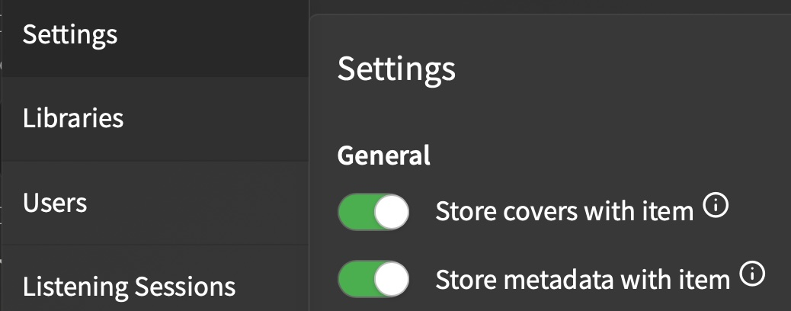

# Audiobook Organizer
[](https://codecov.io/gh/jeeftor/audiobook-organizer)
[](https://coveralls.io/github/jeeftor/audiobook-organizer?branch=main)


CLI tool to organize audiobooks based on **EITHER** `metadata.json` files **OR** embedded metadata in `.epub`, `.mp3`, and `.m4b` files.


## Features

- Organizes audiobooks by author/series/title structure
- Handles multiple authors
- Preserves spaces by default
- Optional space replacement with custom character
- Dry-run mode to preview changes
- Interactive prompt mode for reviewing moves
- Undo functionality
- Colored output
- Operation logs for recovery
- Separate input/output directory support
- **NEW**: Extract metadata directly from EPUB, MP3, and M4B files
- **NEW**: Process files in a flat directory structure

## Pre-requirements

In order for this tool to operate you need to configure audiobookshelf to store `metadata.json` files in the same directories as your books. When this setting is toggled whenver metadata is generated a copy will be stored inside the directory - this is what will be used to rename the books.



## Post-requirements

Because this software is not modifying the internal databse (due to time constraints) upon running the software you *may* end up with a good nubmer of **Missing** books as audiobookshelf. I believe the setting **Enable folder watcher for library** in your library config may inhibit this from happening - but - if it does occur you will see an error like this:


To resolve these issues simply click on the **Issues** button


next use the **Remove All x Books** button to clean up the errors.


## Installation

*There are various ways to install this - I actually haven't tested the Docker install - but it should work :)*

### Ubuntu/Debian

```bash
# Install required dependencies
sudo apt-get install -y jq curl wget

# Download and install the latest release
LATEST_RELEASE=$(curl -s https://api.github.com/repos/jeeftor/audiobook-organizer/releases/latest | jq -r '(.assets[].browser_download_url | select(. | contains("_amd64.deb")))')
wget "$LATEST_RELEASE" -O audiobook-organizer.deb
sudo dpkg -i audiobook-organizer.deb

# Install any missing dependencies
sudo apt-get install -f -y

# Clean up
rm audiobook-organizer.deb
```

### Redhat

```bash
curl -s https://api.github.com/repos/jeeftor/audiobook-organizer/releases/latest | \
grep "browser_download_url.*rpm" | \
cut -d : -f 2,3 | \
tr -d \" | \
wget -qi -
```


### Alpine

```bash
# Download the latest .apk package
curl -s https://api.github.com/repos/jeeftor/audiobook-organizer/releases/latest | \
  grep "browser_download_url.*apk" | \
  cut -d : -f 2,3 | \
  tr -d \" | \
  wget -qi -

# Install the package
sudo apk add --allow-untrusted ./audiobook-organizer_*.apk

# Clean up
rm audiobook-organizer_*.apk
```

# Install the package
sudo rpm -i audiobook-organizer_*.rpm

# Clean up
rm audiobook-organizer_*.rpm

### Go Install

```bash
go install github.com/yourusername/audiobook-organizer@latest
```

### Docker

```bash
docker pull jeffsui/audiobook-organizer:latest
```

## Usage

Basic organization:

```bash

# Organize in place
audiobook-organizer --dir=/path/to/audiobooks

# Organize to separate output directory
audiobook-organizer --dir=/path/to/source/audiobooks --out=/path/to/organized/audiobooks
```

Options:

- `--dir`: Base directory to scan (required)
- `--input`: same as `--dir`
- `--out`: Output directory for organized files (optional, defaults to --dir if not specified)
- `--output`: same as `--out`
- `--replace_space`: Character to replace spaces (optional)
- `--dry-run`: Preview changes without moving files
- `--verbose`: Show detailed progress
- `--undo`: Restore files to original locations
- `--prompt`: Review and confirm each book move interactively
- `--remove-empty`: Remove empty directories after moving files and during initial scan
- `--use-embedded-metadata`: Use metadata embedded in EPUB, MP3, and M4B files if metadata.json is not found
- `--flat`: Process files in a flat directory structure (automatically enables --use-embedded-metadata)

### Docker Usage Examples

Basic usage with single directory:

```bash
# Process current directory
docker run -v $(pwd):/books \
  jeffsui/audiobook-organizer --dir=/books

# Process specific directory
docker run -v /path/to/audiobooks:/books \
  jeffsui/audiobook-organizer --dir=/books
```

Separate input and output directories:

```bash
# Mount source and destination directories
docker run \
  -v /path/to/source:/input:ro \
  -v /path/to/destination:/output \
  jeffsui/audiobook-organizer --dir=/input --out=/output

# Use current directory as source, output to specific directory
docker run \
  -v $(pwd):/input:ro \
  -v /path/to/organized:/output \
  jeffsui/audiobook-organizer --dir=/input --out=/output
```

Interactive mode with input/output:
```bash
# Interactive prompt mode with separate directories
docker run -it \
  -v /path/to/source:/input:ro \
  -v /path/to/destination:/output \
  jeffsui/audiobook-organizer --dir=/input --out=/output --prompt
```

Dry run with verbose output:

```bash
# Preview changes without moving files
docker run \
  -v /path/to/source:/input:ro \
  -v /path/to/destination:/output \
  jeffsui/audiobook-organizer --dir=/input --out=/output --dry-run --verbose
```

### Docker Volume Mounting Notes

- Use `:ro` for read-only access to source directories
- The container paths must match the `--dir` and `--out` parameters
- Use `-it` flag when running with `--prompt` for interactive mode
- Multiple directories can be mounted for source/destination separation
- Source and destination can be the same directory if desired
- Log files will be written to the output directory

### Interactive Mode

Using the `--prompt` flag will show each book's details and proposed move location:

```
Book found:
  Title: The Book Title
  Authors: Author One, Author Two
  Series: Amazing Series #1

Proposed move:
  From: /input/original/path/book
  To: /output/Author One,Author Two/Amazing Series #1/The Book Title

Proceed with move? [y/N]
```

## Metadata Sources

The tool can obtain metadata from two sources:

### 1. metadata.json Files

The tool primarily looks for `metadata.json` files in the same directory as your audiobook files. These files should have the following structure:

```json
{
  "authors": ["Author Name"],
  "title": "Book Title",
  "series": ["Series Name #1"]
}
```

### 2. Embedded EPUB, MP3, and M4B Metadata

When using the `--use-embedded-metadata` flag (which is automatically enabled with `--flat`), the tool can extract metadata directly from EPUB, MP3, and M4B files. This is useful when:

- No metadata.json file exists
- Processing a flat directory of EPUB, MP3, or M4B files
- Working with EPUBs, MP3s, or M4Bs that contain their own metadata

The tool will extract author, title, and series information from the EPUB's, MP3's, or M4B's internal metadata structure.

## Directory Structure

Without series:

```
/output/Author Name/Book Title/
```

With series:

```
/output/Author Name/Series Name #1/Book Title/
```

With multiple authors:

```
/output/Author One,Author Two/Book Title/
```

With space replacement (--replace_space="."):

```
/output/Author.Name/Series.Name.#1/Book.Title/
```

## Recovery

Operations are logged to `.abook-org.log` in the output directory. Use `--undo` to restore files to their original locations:

```bash
# Undo with same input/output configuration
docker run \
  -v /path/to/source:/input \
  -v /path/to/destination:/output \
  jeffsui/audiobook-organizer --dir=/input --out=/output --undo
```

<!--
## FileFlows Docker Mod

If you want to include this in FileFlows you can add the following docker-mod script:

```bash
#!/bin/bash

# Function to handle errors
function handle_error {
    echo "An error occurred. Exiting..."
    exit 1
}

# Check if the --uninstall option is provided
if [ "$1" == "--uninstall" ]; then
    echo "Uninstalling audiobook-organizer..."
    if apt-get remove -y audiobook-organizer; then
        # Clean up repository files
        rm -f /usr/local/share/keyrings/audiobook-organizer.gpg
        rm -f /etc/apt/sources.list.d/audiobook-organizer.list
        apt-get update
        echo "audiobook-organizer successfully uninstalled."
        exit 0
    else
        handle_error
    fi
fi

# Check if audiobook-organizer is already installed
if command -v audiobook-organizer &>/dev/null; then
    echo "audiobook-organizer is already installed."
    exit 0
fi

echo "audiobook-organizer is not installed. Installing..."

# Install required dependencies
apt-get update
apt-get install -y curl gpg

# Create keyrings directory if it doesn't exist
mkdir -p /usr/local/share/keyrings

# Add the repository GPG key
if ! curl -fsSL https://github.com/jeeftor/audiobook-organizer/raw/main/key.gpg | gpg --dearmor -o /usr/local/share/keyrings/audiobook-organizer.gpg; then
    handle_error
fi

# Add repository
if ! echo "deb [signed-by=/usr/local/share/keyrings/audiobook-organizer.gpg] https://github.com/yourusername/audiobook-organizer/releases/latest/download/ /" > /etc/apt/sources.list.d/audiobook-organizer.list; then
    handle_error
fi

# Update package lists and install audiobook-organizer
if ! apt-get update || ! apt-get install -y audiobook-organizer; then
    handle_error
fi

# Verify installation
if command -v audiobook-organizer &>/dev/null; then
    echo "audiobook-organizer successfully installed."
    exit 0
fi

echo "Failed to install audiobook-organizer."
exit 1
```-->


## Configuration

The audiobook organizer supports multiple ways to configure its behavior:

### Configuration File

You can create a YAML configuration file in either:
- Your home directory: `~/.audiobook-organizer.yaml`
- The current directory: `.audiobook-organizer.yaml`
- Or specify a custom location: `--config /path/to/config.yaml`

Example configuration file:

```yaml
# Input directory (use either dir/input)
dir: "/path/to/audiobooks"
# or
input: "/path/to/audiobooks"

# Output directory (use either out/output)
out: "/path/to/organized/audiobooks"
# or
output: "/path/to/organized/audiobooks"

replace_space: "_"
verbose: true
dry-run: false
prompt: true
remove-empty: true  # Remove empty directories
use-embedded-metadata: true # Use metadata embedded in EPUB, MP3, and M4B files
```

### Environment Variables

All options can be set using environment variables with either the prefix `AO_` or `AUDIOBOOK_ORGANIZER_`:

```bash
# Input directory (use any)
export AO_DIR="/path/to/audiobooks"
export AO_INPUT="/path/to/audiobooks"
export AUDIOBOOK_ORGANIZER_DIR="/path/to/audiobooks"
export AUDIOBOOK_ORGANIZER_INPUT="/path/to/audiobooks"


# Output directory (use any)
export AO_OUT="/path/to/output"
export AO_OUTPUT="/path/to/output"
export AUDIOBOOK_ORGANIZER_OUT="/path/to/output"
export AUDIOBOOK_ORGANIZER_OUTPUT="/path/to/output"

# Other settings (use either prefix)
export AO_REPLACE_SPACE="_"
export AO_VERBOSE=true
export AO_REMOVE_EMPTY=true
export AO_USE_EMBEDDED_METADATA=true

# or
export AUDIOBOOK_ORGANIZER_REPLACE_SPACE="_"
export AUDIOBOOK_ORGANIZER_VERBOSE=true
export AUDIOBOOK_ORGANIZER_REMOVE_EMPTY=true
export AUDIOBOOK_ORGANIZER_USE_EMBEDDED_METADATA=true
```

### Command Line Flags

Command line flags take precedence over configuration files and environment variables. The input and output directories can be specified using either of their respective aliases:

```bash
# Using --dir and --out
audiobook-organizer \
  --dir=/path/to/audiobooks \
  --out=/path/to/output \
  --replace_space=_ \
  --verbose \
  --use-embedded-metadata

# Or using --input and --output
audiobook-organizer \
  --input=/path/to/audiobooks \
  --output=/path/to/output \
  --replace_space=_ \
  --verbose \
  --use-embedded-metadata
```

# Configuration Precedence

The configuration values are loaded in the following order (later sources override earlier ones):

1. Default values
2. Configuration file (`~/.audiobook-organizer.yaml` or specified with `--config`)
3. Environment variables
4. Command line flags

For the input and output directories, both aliases (`--dir`/`--input` and `--out`/`--output`) are treated equally, with the last specified value taking precedence.
