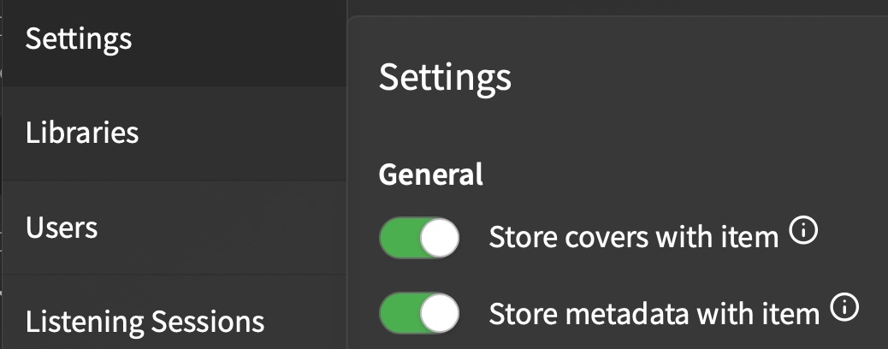

# Audiobook Organizer

[](https://codecov.io/gh/jeeftor/audiobook-organizer)
[](https://coveralls.io/github/jeeftor/audiobook-organizer?branch=main)


**A powerful tool to organize audiobooks by author, series, and title using metadata from multiple sources.**

Supports three modes: **Desktop GUI**, **Interactive TUI**, and **CLI automation**.

---

## What Can It Do?

- 📚 **Organize audiobooks** into clean directory structures (Author/Series/Title)
- 🏷️ **Extract metadata** from metadata.json, EPUB, MP3, M4B files
- 🔄 **Rename files** using customizable templates
- 📂 **Multiple layouts** (6 options from flat to deeply nested)
- 🔍 **Preview changes** before execution with conflict detection
- ↩️ **Undo operations** with full operation logging
- 🎨 **Three interfaces** to match your workflow
- 🎵 **Hybrid metadata mode** - Merges JSON book info with audio track numbers
- 🎯 **Field mapping** - Handle non-standard MP3 metadata structures

---

## Choose Your Experience

Pick the mode that fits your workflow:

| Mode | Best For | How to Launch |
|------|----------|---------------|
| **🖥️ GUI (Desktop App)** | First-time users, visual configuration, exploring metadata | `audiobook-organizer-gui` |
| **⌨️ TUI (Interactive Terminal)** | Power users who prefer keyboard, SSH sessions | `audiobook-organizer tui` |
| **💻 CLI (Command Line)** | Automation, scripts, CI/CD, batch processing | `audiobook-organizer --dir=/path` |

### Feature Comparison

| Feature | GUI | TUI | CLI |
|---------|:---:|:---:|:---:|
| Visual Interface | ✓ | ✓ | - |
| Mouse Support | ✓ | - | - |
| Keyboard Navigation | ✓ | ✓ | - |
| Scriptable/Automatable | - | - | ✓ |
| Live Metadata Preview | ✓ | ✓ | - |
| Field Mapping UI | ✓ | ✓ | Config |
| Color-Coded Paths | ✓ | ✓ | - |
| Native File Dialogs | ✓ | - | - |
| Template Builder UI | ✓ | ✓ | Flags |
| Conflict Highlighting | ✓ | ✓ | Logs |
| SSH/Remote Compatible | - | ✓ | ✓ |

---

## Quick Start

### Installation

Choose your platform:

<details>
<summary><b>macOS</b></summary>

**Desktop GUI:**
```bash
# Coming soon: Homebrew Cask
brew install --cask audiobook-organizer-gui

# Or download DMG from releases
```

**CLI/TUI:**
```bash
brew tap jeeftor/tap
brew install audiobook-organizer
```
</details>

<details>
<summary><b>Linux</b></summary>

**Desktop GUI:**
```bash
# Download from releases:
# - .deb for Debian/Ubuntu
# - .rpm for RedHat/Fedora
# - .AppImage for any distro
```

**CLI/TUI:**
```bash
# Debian/Ubuntu
sudo apt install audiobook-organizer

# RedHat/Fedora
sudo yum install audiobook-organizer

# Alpine
sudo apk add audiobook-organizer
```
</details>

<details>
<summary><b>Windows</b></summary>

**Desktop GUI:**
```
Download installer from releases page:
- audiobook-organizer-gui-setup.exe
```

**CLI/TUI:**
```
Download from releases:
- audiobook-organizer-windows-amd64.zip
```
</details>

<details>
<summary><b>Docker</b></summary>

```bash
docker pull jeffsui/audiobook-organizer:latest
```
</details>

<details>
<summary><b>Go Install</b></summary>

```bash
# CLI/TUI only
go install github.com/jeeftor/audiobook-organizer@latest
```
</details>

**📖 Full installation guide:** [docs/INSTALLATION.md](docs/INSTALLATION.md)

---

## Usage Guides

### 🖥️ GUI Mode (Desktop App)

The **Audiobook Organizer GUI** provides a modern desktop interface with:
- **Visual workflow** through 4 screens (Directory Picker → Book List → Preview → Complete)
- **Live metadata preview** with color-coded field indicators
- **Interactive field mapping** dialog for custom metadata sources
- **Filename template builder** with visual interface
- **Conflict detection** with visual highlighting

**Launch the GUI:**
```bash
# Standard launch (native file dialogs)
audiobook-organizer-gui

# Pre-populate directories (auto-advances to book list)
audiobook-organizer-gui --dir=/path/to/audiobooks --out=/path/to/organized
```

**Screenshot:** [Main book list screen showing metadata preview and layout options]


**📖 Full GUI guide with screenshots:** [docs/GUI.md](docs/GUI.md)

---

### ⌨️ TUI Mode (Interactive Terminal)

The **TUI (Text User Interface)** provides interactive keyboard navigation for:
- **Organization workflow** with directory picker, book selection, settings, preview
- **Rename workflow** with metadata viewer, field mapping, template builder
- **Real-time filtering** and search as you type
- **Visual progress** tracking with color-coded output

**Launch Organization TUI:**
```bash
# Interactive directory picker
audiobook-organizer tui

# Pre-selected directories
audiobook-organizer tui --dir=/path/to/audiobooks --out=/path/to/organized
```

**Launch Rename TUI:**
```bash
audiobook-organizer rename-tui --dir=/path/to/audiobooks
```

**Keyboard shortcuts:** `↑/↓` navigate, `Enter` select, `Tab` switch widgets, `Ctrl+S` save, `q` back

**📖 Full TUI guide:** [docs/TUI.md](docs/TUI.md)

---

### 💻 CLI Mode (Command Line)

The **CLI** provides scriptable automation for:
- **Batch processing** large libraries
- **CI/CD integration** for automated workflows
- **Cron jobs** for scheduled organization
- **Docker containers** for isolated execution

**Basic organization:**
```bash
# Organize in place
audiobook-organizer --dir=/path/to/audiobooks

# Organize to separate output directory
audiobook-organizer --dir=/source --out=/organized

# Preview changes without moving files
audiobook-organizer --dir=/source --out=/organized --dry-run
```

**Rename files:**
```bash
# Rename with template
audiobook-organizer rename --dir=/path --template="{author} - {series} {series_number} - {title}"

# Preview renames
audiobook-organizer rename --dir=/path --dry-run

# Undo previous rename
audiobook-organizer rename --dir=/path --undo
```

**Common flags:**
- `--dir` / `--input` - Input directory (required)
- `--out` / `--output` - Output directory (defaults to input)
- `--dry-run` - Preview without executing
- `--verbose` - Detailed output
- `--layout` - Directory structure (see layouts guide)
- `--use-embedded-metadata` - Extract from audio files
- `--flat` - Process files individually

**📖 Full CLI reference:** [docs/CLI.md](docs/CLI.md)

---

## Common Tasks

### Task 1: Organize Audiobooks by Metadata

**Problem:** Your audiobooks are scattered in a flat directory or poorly organized.

**Solution:** Use any mode to scan metadata and organize into `Author/Series/Title/` structure.

- **GUI:** Launch → Select directories → Choose layout → Preview → Execute
- **TUI:** `audiobook-organizer tui`
- **CLI:** `audiobook-organizer --dir=/books --layout=author-series-title`

### Task 2: Rename Files with Custom Template

**Problem:** Filenames don't match your preferred pattern.

**Solution:** Use rename mode with a custom template.

- **GUI:** Preview screen → Enable "Rename Files" → Configure template
- **TUI:** `audiobook-organizer rename-tui --dir=/books`
- **CLI:** `audiobook-organizer rename --dir=/books --template="{author} - {title}"`

### Task 3: Extract Metadata from MP3/M4B Files

**Problem:** No metadata.json files, but audio files have embedded tags.

**Solution:** Enable embedded metadata mode.

- **GUI:** Book list screen → Select "embedded (directory)" or "embedded (file)"
- **TUI:** Settings screen → Toggle "Use Embedded Metadata"
- **CLI:** `audiobook-organizer --dir=/books --use-embedded-metadata`

### Task 4: Handle Non-Standard MP3 Tags

**Problem:** MP3 files use "album" field for title or "artist" for author.

**Solution:** Configure field mapping.

- **GUI:** Book list screen → "Configure Field Mapping" button
- **TUI:** Field mapping screen in workflow
- **CLI:** `--author-fields=artist,album_artist --title-field=album`

### Task 5: Undo Previous Organization

**Problem:** Need to revert file moves.

**Solution:** Use undo mode (reads `.abook-org.log`).

- **CLI:** `audiobook-organizer --dir=/books --undo`

---

## Configuration

Configure via **config file**, **environment variables**, or **CLI flags**.

**Config file locations** (in order of precedence):
1. `--config /custom/path.yaml`
2. `./.audiobook-organizer.yaml` (current directory)
3. `~/.audiobook-organizer.yaml` (home directory)

**Example config:**
```yaml
dir: "/path/to/audiobooks"
out: "/path/to/organized"
layout: "author-series-title"
use-embedded-metadata: true
remove-empty: true
author-fields: "authors,narrators,album_artist,artist"
title-field: "album,title"
```

**Environment variables:**
```bash
export AO_DIR="/path/to/audiobooks"
export AO_LAYOUT="author-series-title"
export AO_AUTHOR_FIELDS="authors,narrators,album_artist,artist"
```

**Precedence:** Defaults < Config File < Environment Variables < CLI Flags

**📖 Full configuration guide:** [docs/CONFIGURATION.md](docs/CONFIGURATION.md)

---

## Metadata Sources

The organizer can extract metadata from:
1. **metadata.json files** (Audiobookshelf format)
2. **Embedded EPUB metadata** (Dublin Core)
3. **Embedded MP3 tags** (ID3v2)
4. **Embedded M4B tags** (iTunes-style)

**Hybrid mode:** When metadata.json exists alongside audio files, book-level metadata (title, author) comes from JSON while track-level metadata (track numbers) comes from embedded tags.

**Flat vs Non-Flat:**
- **Flat mode** (`--flat`): Each file processed independently (good for single-file audiobooks)
- **Non-flat mode** (default): All files in a directory treated as one book (good for multi-file albums)

**📖 Metadata extraction guide:** [docs/METADATA.md](docs/METADATA.md)

---

## Directory Layouts

Six layout options to match your organization style:

| Layout | Example Path | Use Case |
|--------|--------------|----------|
| `author-series-title` | `Author/Series/Title/` | Standard (default) |
| `author-series-title-number` | `Author/Series/#1 - Title/` | Numbered series |
| `author-series` | `Author/Series/` | Series-focused |
| `author-title` | `Author/Title/` | No series |
| `author-only` | `Author/` | Flat per author |
| `series-title` | `Series/Title/` | Series without author |

**📖 Layout comparison guide:** [docs/LAYOUTS.md](docs/LAYOUTS.md)

---

## Updates

Check for and install updates easily:

```bash
# Check for updates
audiobook-organizer update --check

# Update to latest version
audiobook-organizer update
```

Automatically detects your installation method (Homebrew, APT, binary, etc.) and uses the appropriate update mechanism.

---

## Docker

Run in a container for isolated execution:

```bash
# Basic usage
docker run -v /path/to/books:/books jeffsui/audiobook-organizer --dir=/books

# Separate input/output
docker run \
  -v /source:/input:ro \
  -v /dest:/output \
  jeffsui/audiobook-organizer --dir=/input --out=/output

# With environment variables
docker run \
  -v /books:/books \
  -e AO_LAYOUT=author-series-title \
  -e AO_VERBOSE=true \
  jeffsui/audiobook-organizer --dir=/books
```

**Docker Compose:**
```yaml
version: '3.8'
services:
  organizer:
    image: jeffsui/audiobook-organizer:latest
    volumes:
      - /media/audiobooks:/input:ro
      - /media/organized:/output
    environment:
      AO_LAYOUT: author-series-title
      AO_VERBOSE: "true"
    command: --dir=/input --out=/output
```

**📖 Full Docker guide:** [docs/CLI.md#docker-usage](docs/CLI.md)

---

## Audiobookshelf Integration

### Prerequisites

Configure Audiobookshelf to store `metadata.json` files in your audiobook directories:



### Post-Organization

After organizing, you may see "Missing" books in Audiobookshelf:


**Solution:** Click **Issues** → **Remove All X Books** to clean up.


**Note:** The **Enable folder watcher for library** setting may help prevent this issue.

---

## Documentation

- **[Installation Guide](docs/INSTALLATION.md)** - Platform-specific installation instructions
- **[GUI Guide](docs/GUI.md)** - Desktop application documentation with screenshots
- **[TUI Guide](docs/TUI.md)** - Interactive terminal interface guide
- **[CLI Reference](docs/CLI.md)** - Command-line flags and examples
- **[Configuration](docs/CONFIGURATION.md)** - Config files, environment variables, precedence
- **[Metadata Guide](docs/METADATA.md)** - Metadata sources, field mapping, hybrid mode
- **[Layout Guide](docs/LAYOUTS.md)** - Directory structure options
- **[Rename Feature](docs/RENAME_FEATURE.md)** - File renaming with templates
- **[Metadata Command](docs/METADATA_COMMAND.md)** - Interactive metadata viewer

---

## Contributing

Contributions are welcome! Please:
- Open an issue for bugs or feature requests
- Submit pull requests with tests
- Follow existing code style

**Development:**
```bash
# Clone repository
git clone https://github.com/jeeftor/audiobook-organizer.git
cd audiobook-organizer

# Build CLI/TUI
make dev

# Build GUI
cd audiobook-organizer-gui
wails build

# Run tests
make test
```

---

## Support

- **Bug reports:** [GitHub Issues](https://github.com/jeeftor/audiobook-organizer/issues)
- **Feature requests:** [GitHub Discussions](https://github.com/jeeftor/audiobook-organizer/discussions)
- **Questions:** [GitHub Discussions Q&A](https://github.com/jeeftor/audiobook-organizer/discussions/categories/q-a)

---

## License

MIT License - see [LICENSE](LICENSE) file

---

## Links

- **Releases:** [GitHub Releases](https://github.com/jeeftor/audiobook-organizer/releases)
- **Docker Hub:** [jeffsui/audiobook-organizer](https://hub.docker.com/r/jeffsui/audiobook-organizer)
- **Homebrew Tap:** [jeeftor/tap](https://github.com/jeeftor/homebrew-tap)
