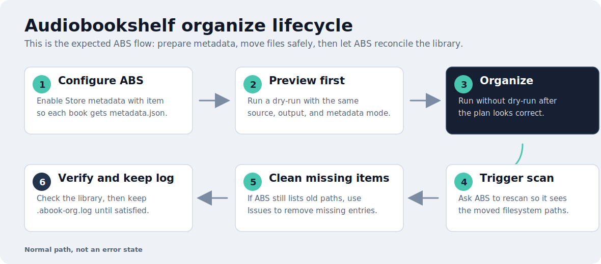

# Audiobookshelf

Audiobookshelf workflows are for libraries where ABS already knows the book metadata or where ABS needs to rescan after filesystem changes.

## Normal Lifecycle

ABS organization is a full cycle: configure ABS to write `metadata.json` files, preview, organize, scan ABS, clean up old missing paths if ABS still reports them, and keep the undo log until the library is verified.



## Configure `metadata.json` Sidecars

For the standard local-folder organize workflow, configure Audiobookshelf to store metadata alongside your books. When this ABS setting is enabled, Audiobookshelf writes a `metadata.json` file into each book directory whenever metadata is generated or updated. Audiobook Organizer can then use those files as the default metadata source.


After this is enabled, a book directory can look like this:

```text
/audiobooks/The Case of Charles Dexter Ward/
  metadata.json
  01 - Chapter 1.mp3
  02 - Chapter 2.mp3
```

You can preview the organizer against those `metadata.json` files without changing files:

```bash
audiobook-organizer \
  --dir=/audiobooks \
  --out=/organized-audiobooks \
  --dry-run
```

Use [Explore Metadata](explore-metadata.md) if you want to inspect what the tool reads from `metadata.json` before organizing.

## Common Scenarios

| Scenario | Use |
| --- | --- |
| Organize from ABS-created `metadata.json` files | normal `audiobook-organizer --dir=... --dry-run` |
| Discover libraries and item counts | `audiobook-organizer abs scan` |
| Validate container-to-host path mapping | `abs scan --abs-path-map=... --check-files` |
| Preview already-indexed metadata | `abs scan --abs-library=... --dir=...` |
| Organize files using ABS metadata | `audiobook-organizer abs organize` |
| Rename mapped files using ABS metadata | Web UI: **Rename** → **Audiobookshelf metadata** |
| Trigger a scan after changes | ABS scan options or the local web UI ABS controls |

## Path Mapping

ABS often runs in a container. The path ABS reports may be different from the host path the organizer can access.

```text
ABS container path: /audiobooks/The Case of Charles Dexter Ward
Host path:          /mnt/media/audiobooks/The Case of Charles Dexter Ward
Mapping flag:       --abs-path-map="/audiobooks:/mnt/media/audiobooks"
```

Use `--check-files` before organizing so missing or incorrect mappings are visible:

```bash
audiobook-organizer abs scan \
  --abs-url=http://localhost:13378 \
  --abs-token="$ABS_TOKEN" \
  --abs-library=Audiobooks \
  --abs-path-map="/audiobooks:/mnt/media/audiobooks" \
  --dir=/mnt/media/audiobooks \
  --check-files
```

## Organize With ABS Metadata

Preview first:

```bash
audiobook-organizer abs organize \
  --abs-url=http://localhost:13378 \
  --abs-token="$ABS_TOKEN" \
  --abs-library=Audiobooks \
  --abs-path-map="/audiobooks:/mnt/media/audiobooks" \
  --dir=/mnt/media/audiobooks \
  --out=/mnt/media/organized \
  --dry-run
```

Then run without `--dry-run` after the plan looks right.

## Web UI ABS Flow

The local web UI can use ABS as the metadata source for the normal **Organize** and **Rename** workflows. Start `audiobook-organizer web`, choose **Guide Me** → your workflow → **Audiobookshelf API** (or choose **Audiobookshelf metadata** directly in advanced setup), then enter the ABS URL and token, choose the discovered library, and validate the path mapping. The usual dry-run preview and selected review stay in place; the run uses mapped ABS item metadata instead of local `metadata.json` or embedded tags. Rename keeps a matched audio file's ABS track number for templates.

The separate **Audiobookshelf** workflow still exposes connection checks, item inspection, library state, scan triggering, and missing-item cleanup.

```bash
audiobook-organizer web
```

See [Local Web UI](GUI.md) for the browser workflow.

## Safety Notes

- Keep `--dry-run` in place until path mappings are correct.
- Use a separate output directory for the first ABS organize run.
- Keep `.abook-org.log` until ABS has scanned and you have verified the library.
- Trigger an ABS scan after filesystem moves so the server reconciles changed paths.
- Clean up missing old-path entries if ABS still lists them after the scan.

## After Organizing: Scan And Clean Up Missing Items

Audiobook Organizer moves files on disk; it does not directly rewrite Audiobookshelf database rows. After a non-dry-run organization, scanning and missing-item cleanup are normal post-run steps for ABS-managed libraries.

First trigger an Audiobookshelf library scan so ABS can discover moved files. If the library still shows issues like missing books after the scan, open the ABS **Issues** view:


Then use the missing-books cleanup action:


If you enable the ABS library folder watcher, ABS may detect some path changes automatically. Even with the watcher enabled, a deliberate scan after filesystem moves is still the safer habit.
